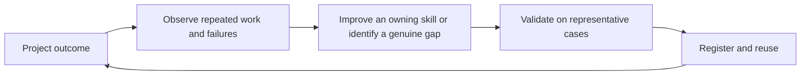

# {{PROJECT_NAME}} — AI-Age Engineering Principles

**Purpose:** Maximize verified user value, quality and performance while minimizing unnecessary delivery cost, operating burden, context and lock-in.

**99/10 shorthand:** Keep almost all of the quality that matters, while cutting waste in cost, effort, and idle AI use. It is a compass for choices, not a score you must prove. Do not spend resources proving a ratio unless an actual decision already has usable data and materially depends on it.

## North Star — AI-native engineering

Doing the work got cheap. First drafts, busy tools, and fast helpers can rush a result into existence. What stays scarce is clear thinking: what to build, when to invest, whom to bring along, and how to leave the system free to change.

As execution gets cheaper, **intent becomes capital**. Tools can shorten the walk from a wish to a working outcome. They cannot invent what you mean, decide what is right, or put a human name on the choice.

These ten principles keep that speed pointed at proven value. Prefer outcome-linked economics over idle seat licenses and ungoverned token burn. Apply the principles below across planning, design, build, test, deploy, improve, reuse, govern and commercials.

## Operating model — Intent, direction and progressive elaboration

This section is owner-authored operating philosophy for AI-age delivery. It is the decision brain for planning with agents and reusable assets. Keep it vendor-neutral and public-safe (no project brand, no sacred-vocabulary loanwords on consuming sites unless the project explicitly chooses them).

### What must be clear before generation

| Human holds (day one) | May still be incomplete |
|---|---|
| **Intent** — the resolve: what change or outcome we mean | Finished customer journeys |
| **Direction** — where we are trying to go (and what we refuse) | Perfect acceptance criteria for every stage |
| **Boundaries** — non-negotiables (risk, policy, ethics, scope edges) | Subject-matter mastery of every downstream detail |

Intent without direction is vague wishing. Direction without intent is motion without meaning. Together they are enough to start. Journeys, stage goals and acceptance criteria are **not** prerequisites for starting—they are products of elaboration.

### How elaboration works (differentiate, do not invent strategy)

Treat the work like progressive differentiation from a living seed: the whole carries the intent; parts become distinct as clarity grows.

```text
Intent + direction + boundaries
        ↓
 progressive elaboration (humans + reusable assets + AI)
        ↓
 journeys / stages / end-state hypotheses
        ↓
 acceptance criteria per stage (still human-gated before high stakes)
        ↓
 generation / build / verify
```

- Reusable assets and AI help **unfold** journeys, stage goals and criteria from clear intent and direction.
- They do **not** replace human authority over strategy, ethics or go/no-go.
- Do not demand that a stakeholder be a master of the domain’s full acceptance matrix before any draft exists. Demand that they can state intent and direction so elaboration has a compass.
- Ideal end-state need not be fully formed on day one; it must be approachable and revisable under the same intent.

### Force-multiplier choice

Narrow intent scales constriction (cost cuts and containment alone). Expansive, evidence-led intent turns agents into amplifiers (exploration, verified value, evolvable systems). Prefer the latter when the business goal is growth and learning—not only reduction.

### Planning test (before Sutra 1 detail)

1. Can we name the intent in one plain sentence?
2. Can we name the direction and at least one hard boundary?
3. Are we treating journeys and acceptance criteria as **next elaboration**, not as blockers to that clarity?
4. Is a human still accountable for approving high-stakes outputs after elaboration?

If (1)–(2) fail, stop generation. If (3) is inverted (waiting for perfect criteria before intent is clear), reset.

**Operating frame — The 10 principles of building with AI:** Use them as decision tests, not slogans. Each one names a phase, a short rule, a practical check, and a concrete scenario. Principle 1 operationalizes the operating model. Principle 10 keeps the list itself swappable.

**Writing craft:** When creating or refining any principle row—or other site prose—use RA-006 [`writing-craft.md`](https://github.com/aispanda/reusable-ai-assets/blob/main/AI-Native%20Website%20Delivery%20System/deliver-websites/references/writing-craft.md) (type `principle-sutra` for these rows). The compressed line may stay elevated; rule, practical test and example must stay plain and concrete.

## The 10 principles

### 1. Aim Before You Generate (Planning)

| | |
|---|---|
| **Sutra** | Name the Intent, Unfold the Path. |
| **Rule** | Before anyone generates work, say what you want, which way you are going, and which hard limits do not move (see Operating model above). You do not need finished journey maps or perfect acceptance tests on day one. Start with a clear aim. Fill in the path as you go, with people and tools helping. AI cannot invent the aim for you. |
| **Practical test** | Hand the brief to someone who was not in the room. Can they answer, in one or two sentences: what are we trying to achieve, which way are we going, and what must we not cross? If any answer is vague, stop generating and sharpen those first. |
| **Example** | A claims lead writes: first-pass decisions in under two days, and never auto-approve a fraud flag. That is enough to begin. The team then drafts the customer steps and checks with AI help. |

### 2. Test the Logic Before You Trust the Draft (Testing)

| | |
|---|---|
| **Sutra** | Trust the Vision, Test the Math. |
| **Rule** | Treat AI output as a draft, not a fact. Before it can change a live system, automated checks (tests the computer runs every time) must prove the critical logic. If a check fails, it does not ship. Human approval for high-stakes actions is separate (see principle 08). |
| **Practical test** | Would an unsafe or wrong AI draft be stopped by an automated check before it can change production? |
| **Example** | An AI agent drafts discount rules. A fitness test proves a 10% discount can never reduce a bill to zero. Only then can the change move toward the customer system. |

### 3. Own the Track, Swap the Engines (Designing)

| | |
|---|---|
| **Sutra** | Own the Track, Swap the Engines. |
| **Rule** | Own the track: contracts, data shapes, APIs, and adapters live in your repository so you can inspect and change them. Keep the gate wide for engines: paid, open, local, or cloud may win when they score on your value drivers. Prove the choice with a pilot on your data (see principle 05). Require an exit path so a brand or geography cannot trap you. |
| **Practical test** | If the winning model or vendor changes next quarter, can you switch without rewriting the product, and without losing ownership of your core? |
| **Example** | A paid model wins this quarter’s claims pilot on accuracy and speed. It plugs in through your adapter. Next quarter a cheaper or local option wins the same test. You change config. You do not rebuild the product. |

**Design note — Clicks versus code is not the decision:** Choose the medium by lifecycle value, editability, verification, and exit cost, not by how it was authored.

### 4. Save the Request First, Run AI Second (Building)

| | |
|---|---|
| **Sutra** | Lock the Data First, Work the AI Second. |
| **Rule** | When a person or system sends a request, store it and confirm receipt right away. Do not make them wait on an AI model (the service that drafts answers or analysis). If that model is slow, rate-limited (only so many calls allowed), busy, or offline, the acknowledgment still goes out. AI work runs afterward in the background. |
| **Practical test** | Does the user get a clear “we received this” and a saved record before any AI model finishes its work? |
| **Example** | An urgent support ticket is saved and the customer sees a receipt immediately. Later, a background job asks the AI model for policy context and a draft reply. The customer never stares at a spinner waiting on the model. |

### 5. Pilot on Your Data, Route by Role (Improving & Selecting)

| | |
|---|---|
| **Sutra** | Inventory the Models, Benchmark the Pilot, Route by Role. |
| **Rule** | Keep a short list of candidate AI models and agent roles. Choose by pilot results on your data and value drivers. Prestige, price, and origin story are not evidence. Separate that from hard policy limits such as where data may live or required certifications. Pit options head to head so providers compete for your workload. Route each job to the cheapest mix that still meets your quality bar. |
| **Practical test** | Is live routing based on a pilot on this project’s data and metrics, not on prestige, price, or origin story? |
| **Example** | A translation pilot shows a little-known low-cost model extracts facts as well as a famous premium one. Production uses the cheaper extractor plus a small checker model. Cost drops. Quality holds. Data-residency rules still decide where the service may run. |

### 6. Keep the Skills Where They Can Grow (Maintaining & Reusing)

| | |
|---|---|
| **Sutra** | Grow the Skill, Pass It On. |
| **Rule** | When an AI method works, save the ask, the background you gave it, and the check that proved the answer. Keep that skill where teammates can find it, reuse it, and make it better. Prefer improving the shared skill over starting again in a private chat. Give the AI only what this job needs. |
| **Practical test** | After this work, could a teammate find, reuse, and improve what worked, or does it still live only in one chat history? |
| **Example** | A claims team lands a prompt and a check that catch bad discounts. They save both as a shared skill. Next month another team reuses them, improves one line, and the method spreads. |

### 7. Pay for Use, Not for Idle Time (Deploying)

| | |
|---|---|
| **Sutra** | Scale on Demand, Pay Zero when Idle. |
| **Rule** | Run the service on hosting that can scale down to near zero cost when idle, and scale up automatically when people use it. Stay ready. Do not pay full price all night for empty machines. |
| **Practical test** | When nobody is using it, is hosting cost near zero, and when demand spikes, does capacity still grow automatically? |
| **Example** | An internal AI tool scales up for the workday and scales down overnight. It stays available without burning money while idle. |

### 8. AI Recommends, Humans Decide (Governance)

| | |
|---|---|
| **Sutra** | AI Recommends, Human Decides. |
| **Rule** | When intelligence acts in the world, a human owns the consequence. Check what the AI produced. Hide sensitive data before the model sees it. For high-stakes actions, a named human must approve before anything takes effect. Do not blame the model for a rubber-stamp you never truly made. Legal, ethical, and money accountability stay human. |
| **Practical test** | If this went wrong, can you name who checked the draft and who approved any high-stakes effect? |
| **Example** | An agent drafts a settlement letter. The operations manager checks the citations and clicks Approve before anything is sent. The model recommended. The human decided. |

### 9. Score the Destination, Not the Fuel Sticker (Commercials & Metrics)

| | |
|---|---|
| **Sutra** | Pay for the Destination, Not the Fuel. |
| **Rule** | When you choose models, tools, or plans, do not let cost-per-token or cost-per-seat be the whole story. Those stickers can mislead. Ask what it costs to reach a verified business result (a resolved ticket, a correct extraction, a safe change), including retries, human review, and failure. Prefer the option that wins on that scorecard at acceptable quality and risk. Never cut the checks that keep work safe just to look cheap on fuel. |
| **Practical test** | If two options have different token or seat prices, can you still say which one is cheaper per verified outcome on your work? |
| **Example** | Model A is cheaper per token but needs many retries and heavy cleanup. Model B costs more per token and finishes clean once. On cost per resolved claim, B wins. The team chooses B. |

### 10. Use the Raft, Don’t Worship It (Evolution)

| | |
|---|---|
| **Sutra** | Cross With the Raft, Leave the Raft. |
| **Rule** | Treat this list as a raft: use it to get somewhere real. Do not carry it on your back after it has done its job. If a clearer principle appears, and a pilot or hard lesson proves it stronger, replace the weaker line. Say “not that anymore” without shame. Record what changed and why. Humans still ACCEPT. Fashion and poster loyalty are not crossing. |
| **Practical test** | If a better principle showed up tomorrow with proof, could you leave an old line behind without treating this page as sacred? |
| **Example** | A team outgrows one rule after two live failures. They draft a stronger line, test it, and retire the old one. The crossing continues. The raft changes. |

## AI-enabled evolution loop



Specific technologies and vendors belong in the decision register, not in this philosophy.

**Evidence note:** Theme-to-sutra links and the **Operating model — Intent, direction and progressive elaboration** section are owner-authored operating philosophy (`INFERRED` synthesis / owner flow). Do not present unread books or LLM-suggested bibliographies as sources, derivation proof, or personal reading claims. Optional further-reading lists, if used at all, must be labelled as adjacent material—not grounding for these principles. Adjacent industry vocabulary includes intent-driven development and progressive elaboration; those labels are orientation aids, not citations of unread works.
